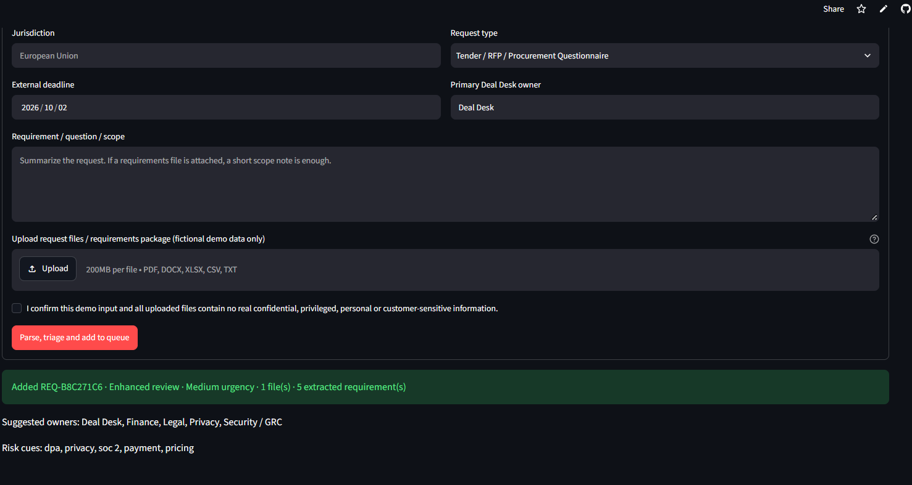
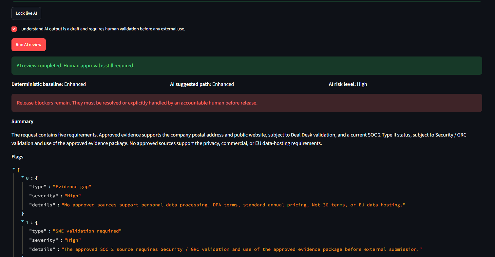
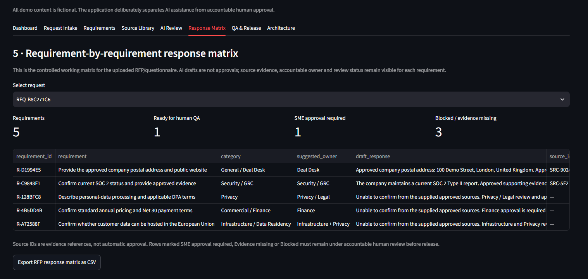
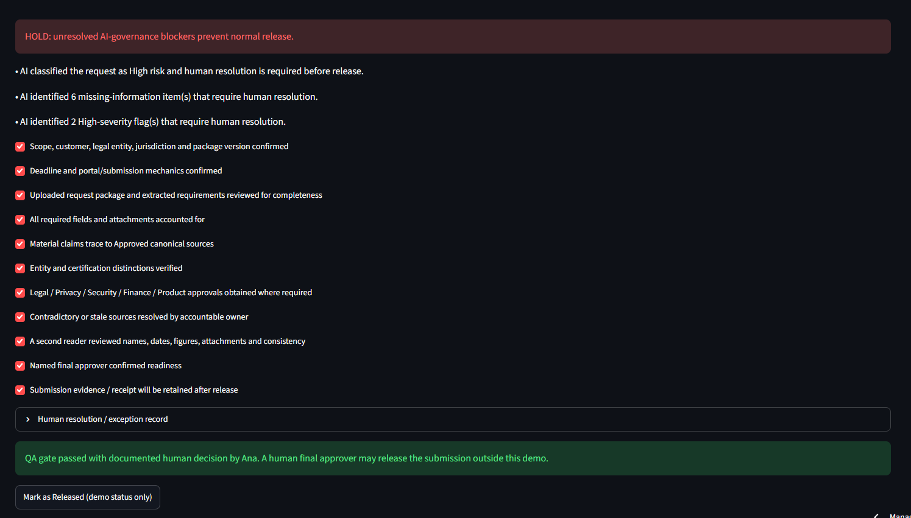
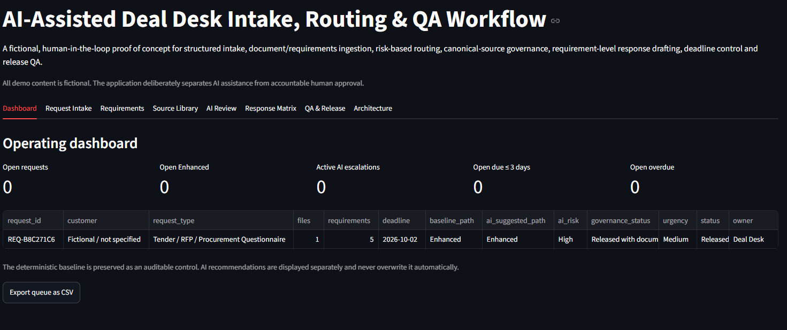

# AI-Assisted Deal Desk Intake, Routing & QA Workflow

A working human-in-the-loop proof of concept for structured Deal Desk intake, document ingestion, requirement-level routing, canonical-source governance, AI-assisted drafting, deadline control, second-read QA, and controlled release.

> **Portfolio demo only.** All demo data is fictional. Do not upload confidential, privileged, personal, or customer-sensitive information.

## Live demo

**Streamlit:** https://ana-aralde-ai-deal-desk.streamlit.app/  
**GitHub:** https://github.com/ana-aralde/ai-deal-desk-workflow

## What the workflow demonstrates

The prototype is designed around a simple principle: **AI can assist with routing, evidence retrieval, drafting, and QA, but it does not own final approval or external commitments.**

The workflow can:

- capture structured request context and deadlines;
- ingest fictional PDF, DOCX, XLSX, CSV, and TXT packages;
- extract and categorize requirements;
- suggest accountable owners such as Deal Desk, Legal, Privacy, Security/GRC, Finance, Product, or Infrastructure;
- preserve a deterministic baseline review path;
- retrieve only Approved canonical sources;
- surface evidence gaps instead of inventing unsupported answers;
- generate requirement-level draft responses;
- create an RFP response matrix with source IDs and review status;
- block normal release when governance issues remain;
- require a named human decision and rationale before release;
- retain the request as historical audit context after release.

## Workflow demo

### 1. Structured request intake and document upload

The intake captures the request type, deadline, Deal Desk owner, scope, and fictional request package. The example CSV is parsed into five requirements and routed to the relevant functions.

### 2. AI-assisted review

The AI review remains advisory. It keeps the deterministic baseline visible, assigns an AI risk level, surfaces blockers, and requires human validation before external use.

### 3. Requirement-by-requirement response matrix

The response matrix links each requirement to its draft response, suggested owner, supporting source IDs, and review status.

In this demo run, some requirements intentionally remained **Evidence missing** because the retrieval layer did not have approved evidence for every claim. The system did not fabricate answers; it surfaced the gaps and kept them under human review.

### 4. Human QA and release gate

The QA gate requires human checks and documented resolution of AI-governance blockers before the fictional request can be released.

### 5. Historical state after release

After release, active request and escalation metrics return to zero while the historical request remains visible with its review path, AI risk, and release status.

## Core design decisions

### Deterministic baseline + AI advisory layer

The rule-based baseline is preserved for auditability. AI recommendations are displayed separately and never silently overwrite it.

### Canonical-source governance

Only sources marked `Approved` are eligible for AI-supported drafting. Customer documents are treated as request input, not as proof of company claims.

### Evidence-gap behavior

If approved evidence is unavailable, the workflow marks the requirement as missing evidence or blocked rather than inventing a response.

### Source freshness logic

The stored source date is interpreted as the **next review date**. A source is within its review window when the submission deadline is on or before that date. A deadline after the next review date triggers revalidation.

### Human-in-the-loop release

High-risk flags, missing information, and governance blockers prevent normal release until an accountable human records the resolution or exception.

## Technology

- Python
- Streamlit
- pandas
- OpenAI API
- pypdf
- python-docx
- openpyxl

## Public-demo safeguards

- fictional data only;
- session-scoped application data;
- common PII-pattern redaction before API transmission;
- private demo-access code for paid AI calls;
- per-session AI call limit;
- no autonomous Send/Submit action.

Pattern-based redaction is not a complete DLP system. A production implementation would require enterprise authentication, RBAC, persistent encrypted storage, audit logging, retention controls, malware scanning, DLP/classification, stronger source metadata, production observability, and formal security/privacy review.

## What this project is

This is a **working portfolio proof of concept**, not a production Deal Desk platform.

It demonstrates workflow design, AI-assisted operations, requirements analysis, source governance, risk routing, evidence traceability, human review, and controlled release.

## Design takeaway

The goal is not to make AI the decision-maker. The goal is to make a human-controlled Deal Desk workflow **faster, more structured, more traceable, and harder to release incorrectly**.
